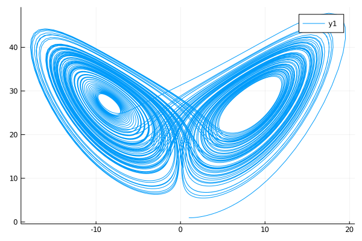

## CellMLToolkit.jl

[](https://travis-ci.com/SciML/CellMLToolkit.jl)

CellMLToolkit.jl is a Julia library that connects CellML models to the Scientific Julia ecosystem.

CellML (http://cellml.org) is an XML-based open-standard for the exchange of mathematical models. CellML originally started in 1998 by the Auckland Bioengineering Institute at the University of Auckland and affiliated research groups. Since then, its repository (https://models.physiomeproject.org/welcome) has grown to more than a thousand models. While CellML is not domain-specific, its focus has been on biomedical models. Currently, the active categories in the repository are *Calcium Dynamics*, *Cardiovascular Circulation*, *Cell Cycle*, *Cell Migration*, *Circadian Rhythms*, *Electrophysiology*, *Endocrine*, *Excitation-Contraction Coupling*, *Gene Regulation*, *Hepatology*, *Immunology*, *Ion Transport*, *Mechanical Constitutive Laws*, *Metabolism*, *Myofilament Mechanics*, *Neurobiology*, *pH Regulation*, *PKPD*, *Protein Modules*, *Signal Transduction*, and *Synthetic Biology*. There are many software tools to import, process and run CellML models; however, these tools are not Julia-specific.

SciML (http://github.com/SciML) is a collection of Julia libraries for open source scientific computing and machine learning. The centerpiece of SciML is DifferentialEquations.jl (https://github.com/SciML/DifferentialEquations.jl), which provides a rich set of ordinary differential equations (ODE) solvers. One major peripheral component of SciML is ModelingToolkit.jl (https://github.com/SciML/ModelingToolkit.jl). It is a modeling framework for high-performance symbolic-numeric computation in scientific computing and scientific machine learning. The core of ModelingToolkit.jl is an intermediate representation (IR) language to code the scientific problems of interest in a high level. Automatic code generation and differentiation allow for the generation of a usable model for the other components of SciML, such as DifferentialEquations.jl.

CellMLToolkit.jl acts as a bridge between CellML and ModelingToolkit.jl. It imports a CellML model (in XML) and emits a ModelingToolkit.jl IR, which can then enter the SciML ecosystem.

## Examples

The models directory of the CellMLToolkit.jl contains few CellML model examples. Let's start with a simple one, the famous Lorenz equations!

```Julia
  using CellMLToolkit

  ml = CellModel("models/lorenz.cellml.xml")

  tspan = (0, 100.0)
  prob = ODEProblem(ml, tspan)
```

Now, `ml` points to a `CellModel` struct that contains the details of the model and `prob` is an `ODEProblem` ready for integration. We can solve and visualize `prob` as

```Julia
  using DifferentialEquations, Plots

  sol = solve(prob, TRBDF2(), dtmax=0.01)
  X = map(x -> x[1], sol.u)
  Z = map(x -> x[3], sol.u)
  plot(X, Z)
```

As expected,



Let's look at more complicated examples. The next one is the ten Tusscher-Noble-Noble-Panfilov human left ventricular action potential model (https://journals.physiology.org/doi/full/10.1152/ajpheart.00794.2003). It is a mid-range electrophysiology model with 17 states variables and relatively good numerical stability.

```Julia
  ml = CellModel("models/tentusscher_noble_noble_panfilov_2004_a.cellml.xml")
  tspan = (0, 5000.0)
  prob = ODEProblem(ml, tspan)
  sol = solve(prob, TRBDF2(), dtmax=1.0)
  V = map(x -> x[1], sol.u)
  plot(sol.t, V)
```


We can also enhance the model by asking ModelingToolkit.jl to generate a Jacobian by passing `jac=true` to the `ODEProblem` constructor.

```Julia
  prob = ODEProblem(ml, tspan; jac=true)  
```

The rest remains the same. For the last example, we chose a complex model to stress the ODE solvers: the  O'Hara-Rudy left ventricular model (https://journals.plos.org/ploscompbiol/article?id=10.1371/journal.pcbi.1002061). This model has 49 state variables, is very stiff, and is prone to oscillation. The best solver for this model is `CVODE_BDF` from the Sundial suite.

```Julia
  ml = CellModel("models/ohara_rudy_cipa_v1_2017.cellml.xml")
  tspan = (0, 5000.0)
  prob = ODEProblem(ml, tspan);
  sol = solve(prob, CVODE_BDF(), dtmax=0.5)
  V = map(x -> x[1], sol.u)
  plot(sol.t, V)
```


