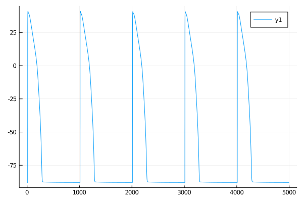

# CellMLToolkit.jl

CellMLToolkit.jl is a Julia library that connects [CellML](http://cellml.org) models to [SciML](http://github.com/SciML), the Scientific Julia ecosystem. CellMLToolkit.jl acts as a bridge between CellML and ModelingToolkit.jl. It imports a CellML model (in XML) and emits a ModelingToolkit.jl intermediate representation (IR), which can then enter the SciML ecosystem.

## CellML

[CellML](http://cellml.org) is an XML-based open-standard for the exchange of mathematical models. CellML originally started in 1998 by the Auckland Bioengineering Institute at the University of Auckland and affiliated research groups. Since then, its [repository](https://models.physiomeproject.org/welcome) has grown to more than a thousand models. While CellML is not domain-specific, its focus has been on biomedical models. Currently, the active categories in the repository are *Calcium Dynamics*, *Cardiovascular Circulation*, *Cell Cycle*, *Cell Migration*, *Circadian Rhythms*, *Electrophysiology*, *Endocrine*, *Excitation-Contraction Coupling*, *Gene Regulation*, *Hepatology*, *Immunology*, *Ion Transport*, *Mechanical Constitutive Laws*, *Metabolism*, *Myofilament Mechanics*, *Neurobiology*, *pH Regulation*, *PKPD*, *Protein Modules*, *Signal Transduction*, and *Synthetic Biology*. There are many software tools to import, process and run CellML models; however, these tools are not Julia-specific.

## SciML

[SciML](http://github.com/SciML) is a collection of Julia libraries for open source scientific computing and machine learning. The centerpiece of SciML is [DifferentialEquations.jl](https://github.com/SciML/DifferentialEquations.jl), which provides a rich set of ordinary differential equations (ODE) solvers. One major peripheral component of SciML is [ModelingToolkit.jl](https://github.com/SciML/ModelingToolkit.jl). It is a modeling framework for high-performance symbolic-numeric computation in scientific computing and scientific machine learning. The core of ModelingToolkit.jl is an IR language to code the scientific problems of interest in a high level. Automatic code generation and differentiation allow for the generation of a usable model for the other components of SciML, such as DifferentialEquations.jl.

## Install

To install, run

```julia
  ] add CellMLToolkit
```

## Simple Example

```Julia
  using CellMLToolkit, OrdinaryDiffEq, Plots

  prob = read_cellml("models/lorenz.cellml.xml", (0,100.0))
  sol = solve(prob)
  plot(sol, vars=(1,3))
```

# Tutorial

The models directory contains a few CellML model examples. Let's start with a simple one, the famous Lorenz equations!

```Julia
  using CellMLToolkit

  prob = read_cellml("models/lorenz.cellml.xml", (0,100.0))
```

Now, `prob` is an `ODEProblem` ready for integration. Here, `(0,100.0)` is the `tspan` parameter, describing the integration range of the independent variable.
In addition to the model equations, the initial conditions and parameters are also read from the XML file and are available as `prob.u0` and `prob.p`, respectively.
We can solve and visualize `prob` as

```Julia
  using DifferentialEquations, Plots

  sol = solve(prob)
  plot(sol, vars=(1,3))
```

As expected,


Let's look at more complicated examples. The next one is the [ten Tusscher-Noble-Noble-Panfilov human left ventricular action potential model](https://journals.physiology.org/doi/full/10.1152/ajpheart.00794.2003). This is a mid-range electrophysiology model with 17 states variables and relatively good numerical stability.

```Julia
  prob = read_cellml("models/tentusscher_noble_noble_panfilov_2004_a.cellml.xml", (0, 10000.0))
  sol = solve(prob, TRBDF2(), dtmax=1.0)
  plot(sol, vars=12)
```


We can tell which variable to plot (vars=12, here) by looking at the output of 'list_states' (see below).

Instead of directly generating an `ODEProblem` by calling `read_cellml`, we can use a two-step process with more control by first calling `CellModel` factory function:

```Julia
  ml = CellML("models/tentusscher_noble_noble_panfilov_2004_a.cellml.xml")
```

`CellModel` is a light wrapper around an `ODESystem`. We can access the underlying `ODESystem` as `getsys(ml)` and the model XML as `getxml(ml)` (as an [EzXML](https://github.com/JuliaIO/EzXML.jl) tree). We can then generate an `ODEProblem` as

```Julia
  tspan = (0, 10000)
  prob = ODEProblem(ml, tspan)
  sol = solve(prob, TRBDF2(), dtmax=1.0)
  plot(sol, vars=1)
```

One benefit of going through `CellModel` instead of direct `ODEProblem` generation is the ability to modify initial values and parameters. Let's look at the Beeler-Reuter model with 8 state variables:

```Julia
  ml = CellModel("models/beeler_reuter_1977.cellml.xml")
```

The model parameters are listed as `list_params(ml)`:

```Julia
                  sodium_current₊g_Na => 0.04
                  sodium_current₊E_Na => 50.0
                 sodium_current₊g_Nac => 3.0e-5
         stimulus_protocol₊IstimStart => 10.0
           stimulus_protocol₊IstimEnd => 50000.0
     stimulus_protocol₊IstimAmplitude => 0.5
        stimulus_protocol₊IstimPeriod => 1000.0
 stimulus_protocol₊IstimPulseDuration => 1.0
              slow_inward_current₊g_s => 0.0009
                           membrane₊C => 0.01
```

Note the form of the parameter and variable names. They are composed of two names joined by a ₊ sign. The first name is the
component name in CellML models (e.g., sodium_current, stimulus_protocol) and the second name is the actual variable name.

Similarly, we can list the state variables by calling `list_states(ml)`:

```Julia
              slow_inward_current_d_gate₊d(time) => 0.003
              slow_inward_current_f_gate₊f(time) => 0.994
                   sodium_current_j_gate₊j(time) => 0.975
                   slow_inward_current₊Cai(time) => 0.0001
 time_dependent_outward_current_x1_gate₊x1(time) => 0.0001
                   sodium_current_m_gate₊m(time) => 0.011
                   sodium_current_h_gate₊h(time) => 0.988
                                membrane₊V(time) => -84.624
```

Assume we want to change `IstimPeriod`. We can easily do this with the help of `update_list!` utility function provided:

```Julia
  p = list_params(ml)
  update_list!(p, :stimulus_protocol₊IstimPeriod, 250.0)
  prob = ODEProblem(ml, (0, 10000.0); p=p)
```

The rest is the same as before.

```Julia
  sol = solve(prob, TRBDF2(), dtmax=1.0)
  plot(sol, vars=8)   # 8 is the index of membrane₊V
```

For the last example, we chose a complex model to stress the ODE solvers: [the O'Hara-Rudy left ventricular model](https://journals.plos.org/ploscompbiol/article?id=10.1371/journal.pcbi.1002061). This model has 49 state variables, is very stiff, and is prone to oscillation. The best solver for this model is `CVODE_BDF` from the Sundial suite.

```Julia
  using Sundials

  ml = CellModel("models/ohara_rudy_cipa_v1_2017.cellml.xml")
  tspan = (0, 5000.0)
  prob = ODEProblem(ml, tspan);
  sol = solve(prob, CVODE_BDF(), dtmax=0.5)
  plot(sol, vars=49)  # membrane₊v
```


