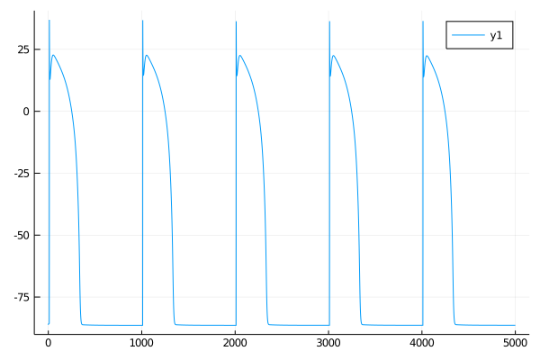
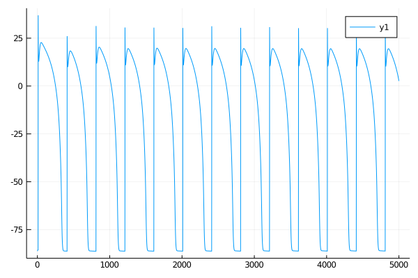

# CellMLToolkit.jl

CellMLToolkit.jl is a Julia library that connects [CellML](http://cellml.org) models to [SciML](http://github.com/SciML), the Scientific Julia ecosystem. CellMLToolkit.jl acts as a bridge between CellML and ModelingToolkit.jl. It imports a CellML model (in XML) and emits a ModelingToolkit.jl intermediate representation (IR), which can then enter the SciML ecosystem.

## CellML

[CellML](http://cellml.org) is an XML-based open-standard for the exchange of mathematical models. CellML originally started in 1998 by the Auckland Bioengineering Institute at the University of Auckland and affiliated research groups. Since then, its [repository](https://models.physiomeproject.org/welcome) has grown to more than a thousand models. While CellML is not domain-specific, its focus has been on biomedical models. Currently, the active categories in the repository are *Calcium Dynamics*, *Cardiovascular Circulation*, *Cell Cycle*, *Cell Migration*, *Circadian Rhythms*, *Electrophysiology*, *Endocrine*, *Excitation-Contraction Coupling*, *Gene Regulation*, *Hepatology*, *Immunology*, *Ion Transport*, *Mechanical Constitutive Laws*, *Metabolism*, *Myofilament Mechanics*, *Neurobiology*, *pH Regulation*, *PKPD*, *Protein Modules*, *Signal Transduction*, and *Synthetic Biology*. There are many software tools to import, process and run CellML models; however, these tools are not Julia-specific.

## SciML

[SciML](http://github.com/SciML) is a collection of Julia libraries for open source scientific computing and machine learning. The centerpiece of SciML is [DifferentialEquations.jl](https://github.com/SciML/DifferentialEquations.jl), which provides a rich set of ordinary differential equations (ODE) solvers. One major peripheral component of SciML is [ModelingToolkit.jl](https://github.com/SciML/ModelingToolkit.jl). It is a modeling framework for high-performance symbolic-numeric computation in scientific computing and scientific machine learning. The core of ModelingToolkit.jl is an IR language to code the scientific problems of interest in a high level. Automatic code generation and differentiation allow for the generation of a usable model for the other components of SciML, such as DifferentialEquations.jl.

## Install

To install, run

```julia
  Pkg.add("CellMLToolkit")
```

## Simple Example

```Julia
  using CellMLToolkit, DifferentialEquations, Plots

  ml = CellModel("models/lorenz.cellml.xml")

  tspan = (0, 100.0)
  prob = ODEProblem(ml, tspan)
  sol = solve(prob, TRBDF2(), dtmax=0.01)
  X = map(x -> x[1], sol.u)
  Z = map(x -> x[3], sol.u)
  plot(X, Z)
```

# Tutorial

The models directory contains few CellML model examples. Let's start with a simple one, the famous Lorenz equations!

```Julia
  using CellMLToolkit

  ml = CellModel("models/lorenz.cellml.xml")

  tspan = (0, 100.0)
  prob = ODEProblem(ml, tspan)
```

Now, `ml` points to a `CellModel` struct that contains the details of the model and `prob` is an `ODEProblem` ready for integration. We can solve and visualize `prob` as

```Julia
  using DifferentialEquations, Plots

  sol = solve(prob, TRBDF2(), dtmax=0.01)
  X = map(x -> x[1], sol.u)
  Z = map(x -> x[3], sol.u)
  plot(X, Z)
```

As expected,


Let's look at more complicated examples. The next one is the [ten Tusscher-Noble-Noble-Panfilov human left ventricular action potential model](https://journals.physiology.org/doi/full/10.1152/ajpheart.00794.2003). This is a mid-range electrophysiology model with 17 states variables and relatively good numerical stability.

```Julia
  ml = CellModel("models/tentusscher_noble_noble_panfilov_2004_a.cellml.xml")
  tspan = (0, 5000.0)
  prob = ODEProblem(ml, tspan)
  sol = solve(prob, TRBDF2(), dtmax=1.0)
  V = map(x -> x[1], sol.u)
  plot(sol.t, V)
```



We can also enhance the model by asking ModelingToolkit.jl to generate a Jacobian by passing `jac=true` to the `ODEProblem` constructor.

```Julia
  prob = ODEProblem(ml, tspan; jac=true)  
```

The rest remains the same. For the last example, we chose a complex model to stress the ODE solvers: [the O'Hara-Rudy left ventricular model](https://journals.plos.org/ploscompbiol/article?id=10.1371/journal.pcbi.1002061). This model has 49 state variables, is very stiff, and is prone to oscillation. The best solver for this model is `CVODE_BDF` from the Sundial suite.

```Julia
  ml = CellModel("models/ohara_rudy_cipa_v1_2017.cellml.xml")
  tspan = (0, 5000.0)
  prob = ODEProblem(ml, tspan);
  sol = solve(prob, CVODE_BDF(), dtmax=0.5)
  V = map(x -> x[1], sol.u)
  plot(sol.t, V)
```


## Changing Parameters

Up to this point, we have run the model exactly as provided by CellML. In practice, we need to be able to modify the model parameters (either the initial conditions or the proper parameters). CellMLToolkit has multiple utility functions that help us interrogate and modify the model parameters.

There are three `list` functions: `list_states`, `list_params`, and `list_initial_conditions`. `list_states` returns a list of the state variables, i.e., the variables present on the left side of an ODE. `list_params` and `list_initial_conditions` return arrays of (variable, value) pairs, providing the model parameters and the state variables initial conditions, respectively (corresponding to `p` and `u0` in DifferentialEquations.jl nomenclature).

Here, we are interested in `list_params`. Let's go back to the ten Tusscher-Noble-Noble-Panfilov model and list its params:

```julia
  ml = CellModel("models/tentusscher_noble_noble_panfilov_2004_a.cellml.xml")
  p = list_params(ml)
  display(p)
```

We get a list of the 45 parameters:

```julia
45-element Array{Pair{Operation,Float64},1}:
 stim_start => 10.0
       g_pK => 0.0146
      g_bna => 0.00029
      K_mNa => 40.0
      b_rel => 0.25
       g_Ks => 0.062
      K_pCa => 0.0005
       g_Kr => 0.096
       Na_o => 140.0
       K_up => 0.00025
            ⋮
```

To modify a parameter, we use `update_list!` function. For example, the following code changes the stimulation period (`stim_period`) from its default of 1000 ms to 400 ms

```julia
  update_list!(p, "stim_period", 400.0)
```

We need to pass the new `p` to `ODEProblem` constructor as a keyword parameter. The rest of the code remains the same.

```julia
  tspan = (0, 5000.0)
  prob = ODEProblem(ml, tspan; p=p)
  sol = solve(prob, TRBDF2(), dtmax=1.0)
  V = map(x -> x[1], sol.u)
  plot(sol.t, V)
```



`ODEProblem` also accepts a `u0` parameter to change the initial conditions (remember `u0 = list_initial_conditions(ml)`).
